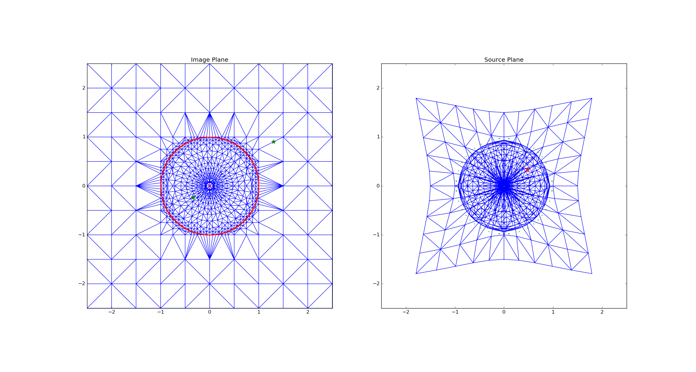

#Welcome!

This project is a Python implementation of the general lens solver GravLens. 

**To build and install the package, type `python setup.py build install`.**
If you are developing, use `python setup.py develop` instead. 

At this current version, this project does the following:
* Take the magnification function for given model(s) and compute the transformation of coordinates from the image plane to the source plane.
* Given a point in the source plane, find the exact position(s) in the image plane. 
* Plot the results. (Sample images are given below!)

# Supported Models
## Fully Implemented:
* Alpha = 1 (Singular Isothermal Ellipsoid)
* Alpha = -1 (Plummer Model)
* General Alpha case
* NFW (Fortran Version)

## Models that are not fully functional in this version:
* NFW (C version)

## Not yet Implemented:
* NFW (Python Version)
* Truncated Models

# Dependencies:
Make sure to install these libraries before running!

* SciPy
* NumPy
* matplotlib.pyplot
* numexpr
* pycallgraph (this library can be excluded if you are not interested in seeing runtimes in the demo, make sure to comment out the relevant lines in `demos/example_run.py`)

For the fortran files, you will need [CUBPACK](http://people.sc.fsu.edu/~jburkardt/f_src/cubpack/cubpack.html) for the integrals. At this point of the project, this library is not bundled with this code.  You must also compile the fortran files yourself, use the `makecommand` files in the folder for an example on how to compile the code.

#Images
##SIE

##Plummer - Alpha = -1 Case
")

